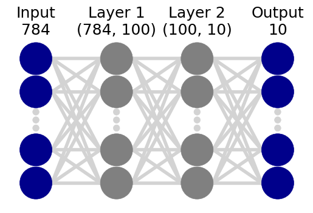
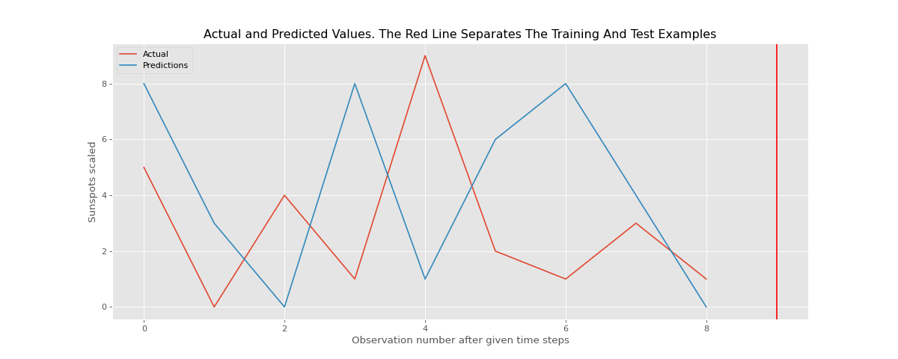

# Image Recognition with Machine Learning

- 6 different algorithms
- KNN, SVM, RFC, MLP, RNN, CNN

{:height="300px" width="500px"}
{:height="300px" width="500px"}
{:height="300px" width="500px"}
{:height="300px" width="500px"}
{:height="300px" width="500px"}

## Getting Started

- Install dependencies

```sh
python -m venv .venv
source .venv/bin/activate
pip install -r requirements.txt
```

## Training

```sh
python main.py -s knn
```

## References

- [Classification Strategies - Scikit-Learn](https://scikit-learn.org/stable/)
- [Charts - Matplotlib](https://python-charts.com/matplotlib/)
