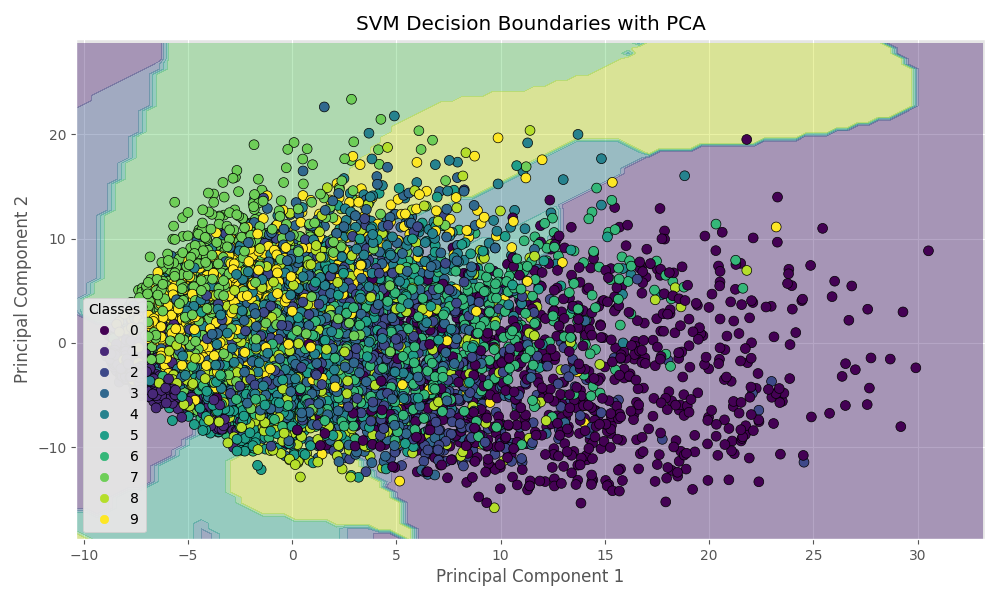

# Handwritten Digit Recognition with Machine Learning

- Implemented with 6 classification algorithms
- Algorithms: KNN, SVM, RFC, MLP, RNN, CNN
  - [K-Nearest Neighbors(KNN)](https://en.wikipedia.org/wiki/K-nearest_neighbors_algorithm)
  - [Support Vector Machines(SVM)](https://en.wikipedia.org/wiki/Support_vector_machine)
  - [Random Forest Classification(RFC)](https://en.wikipedia.org/wiki/Random_forest)
  - [Multi-layer Perceptron(MLP)](https://en.wikipedia.org/wiki/Multilayer_perceptron)
  - [Recurrent Neural Network(RNN)](https://en.wikipedia.org/wiki/Recurrent_neural_network)
  - [Convolutional Neural Network(CNN)](https://en.wikipedia.org/wiki/Convolutional_neural_network)




## Getting Started

- Install dependencies

```sh
python -m venv .venv
source .venv/bin/activate
pip install -r requirements.txt
```

## Training

Use `-s` to select a strategy for training. The available strategies are KNN, SVM, RFC, MLP, RNN, CNN

```sh
python main.py -s knn
```

Use `-m` to select a method to run. For example with `init_trained_model` you can pick up training from where you left off with a saved pickle inside of `tmp/models`

```sh
python main.py -m init_trained_model
```

## Renders

Confusion matrices of the results of training using KNN as well as summaries of other models & their strategies.


## References

- [Classification Strategies - Scikit-Learn](https://scikit-learn.org/stable/)
- [Charts - Matplotlib](https://python-charts.com/matplotlib/)
